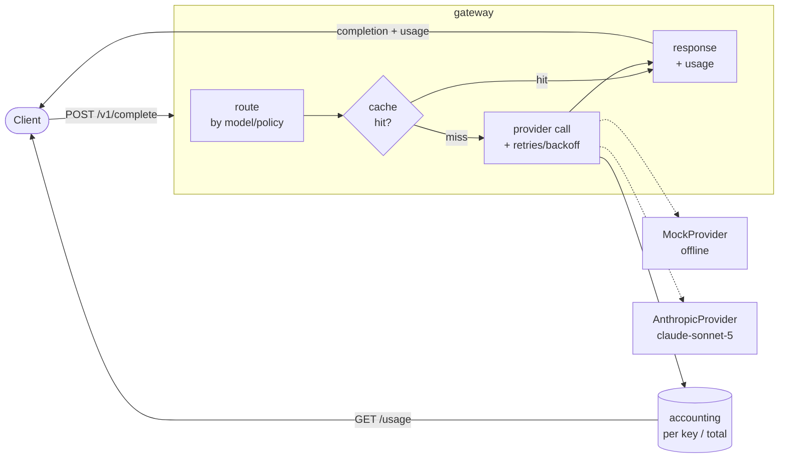

# ai-gateway

A lightweight LLM API gateway (FastAPI) that fronts multiple providers and adds routing, response caching, retries with backoff, and token/cost accounting.


> Portfolio / demo project. The cost table is **illustrative and configurable** — the numbers are rough placeholders for demonstration, not billing-grade rates. No throughput, star, or benchmark claims are made.

## Overview

`ai-gateway` sits between your application and one or more LLM providers and gives you a single HTTP surface with four cross-cutting concerns handled for you:

- **Routing** — choose a backend by model name / policy (e.g. `claude*` → Anthropic, everything else → the offline mock).
- **Caching** — a stable hash of the request maps to a cached completion with a TTL, so identical calls are free and instant.
- **Retries** — transient provider failures are retried with exponential backoff and an injectable clock (no real sleeps in tests).
- **Accounting** — per-request token estimates and cost, aggregated per API key and in total.

Providers live behind an injectable `Provider` protocol. A deterministic `MockProvider` ships in-box so the whole thing runs and tests **offline, with no API key**. A documented `AnthropicProvider` (model `claude-sonnet-5`) is included and degrades gracefully when no key is present.

## Architecture



## Features

- `POST /v1/complete` — `{ model, prompt, max_tokens?, temperature? }` → completion + usage.
- `GET /health` — liveness probe.
- `GET /usage` — token/cost accounting, per key (`X-API-Key`) and in total.
- Pluggable cache (in-memory TTL default) keyed by a stable `hashlib.sha256` of the request.
- Retry/backoff with an **injectable sleep** for deterministic tests.
- Injectable `Provider` protocol; deterministic `MockProvider`; documented `AnthropicProvider`.
- Fully testable offline — the test suite never touches the network.

## Tech stack

- **Python 3.11**, **FastAPI**, **Pydantic v2**
- **Uvicorn** (ASGI server)
- `hashlib` (stdlib) for cache keys
- **pytest** + **ruff** for tests and linting
- Optional **anthropic** SDK for the real backend

## Getting started

```bash
python -m venv .venv && source .venv/bin/activate   # Windows: .venv\Scripts\activate
pip install -e ".[dev]"

# Run the gateway (offline — uses the deterministic MockProvider):
uvicorn aigateway.main:app --reload
```

The server starts with no API key required. Any non-`claude` model routes to `MockProvider`.

## Usage

```bash
# A completion (offline mock backend), tagged with an API key for accounting:
curl -s http://localhost:8000/v1/complete \
  -H "content-type: application/json" \
  -H "X-API-Key: demo-key" \
  -d '{"model": "mock-small", "prompt": "Hello, gateway!"}'
```

```json
{
  "model": "mock-small",
  "provider": "mock",
  "completion": "[mock:mock-small] (a1b2c3d4) You said: Hello, gateway!",
  "cached": false,
  "usage": { "input_tokens": 4, "output_tokens": 13, "total_tokens": 17, "cost_usd": 0.00001725 }
}
```

Send the exact same request again and `"cached": true` comes back instantly (no provider call). Then inspect accounting:

```bash
curl -s http://localhost:8000/usage
```

```json
{
  "totals": { "requests": 1, "input_tokens": 4, "output_tokens": 13, "total_tokens": 17, "cost_usd": 0.00001725 },
  "per_key": {
    "demo-key": { "requests": 1, "input_tokens": 4, "output_tokens": 13, "total_tokens": 17, "cost_usd": 0.00001725 }
  }
}
```

## Enabling a real provider

The Anthropic backend targets model `claude-sonnet-5` and is off unless you opt in:

```bash
pip install ".[anthropic]"
cp .env.example .env          # then set ANTHROPIC_API_KEY=...
export ANTHROPIC_API_KEY=sk-ant-...
```

Requests for `claude*` models now route to `AnthropicProvider`. Without a key (or without the SDK installed), that provider raises a clear `ProviderError` instead of crashing — the offline mock path is unaffected. Cost rates in `aigateway/accounting.py` (`COST_TABLE`) are illustrative; edit them (or pass your own table) to match real pricing.

## Project structure

```
ai-gateway/
├── aigateway/
│   ├── __init__.py       # package exports (create_app, __version__)
│   ├── main.py           # FastAPI app + request pipeline (route→cache→provider→accounting)
│   ├── router.py         # pick a provider by model/policy
│   ├── cache.py          # stable request hash + in-memory TTL cache (injectable clock)
│   ├── providers.py      # Provider protocol + MockProvider + AnthropicProvider
│   ├── accounting.py     # token estimate + cost table + per-key aggregation
│   ├── backoff.py        # retry with exponential backoff (injectable sleep)
│   └── models.py         # pydantic request/response schemas
├── tests/                # pytest, offline, MockProvider only
│   ├── test_routing.py
│   ├── test_cache.py
│   ├── test_retries.py
│   └── test_accounting.py
├── requirements.txt
├── pyproject.toml
├── .env.example
├── .github/workflows/ci.yml
├── .gitignore
├── LICENSE
└── README.md
```

## Testing

```bash
pip install -e ".[dev]"
pytest            # offline; MockProvider only; no network, no real sleeps
ruff check .      # lint
```

Coverage highlights: routing picks the right provider; an identical request is served from cache on the second call (plus TTL expiry via an injected clock); a flaky provider retries then succeeds; usage/cost accounting sums correctly per key and in total.

## Roadmap

- Streaming completions (SSE) through the gateway.
- Redis-backed cache implementation behind the existing `Cache` protocol.
- Per-key rate limiting and quotas.
- Additional provider adapters (OpenAI-compatible, local models).
- Prometheus metrics endpoint.

## License

MIT — see [LICENSE](LICENSE).

---

Part of my cloud & AI portfolio — see [github.com/matthews-wong](https://github.com/matthews-wong).
